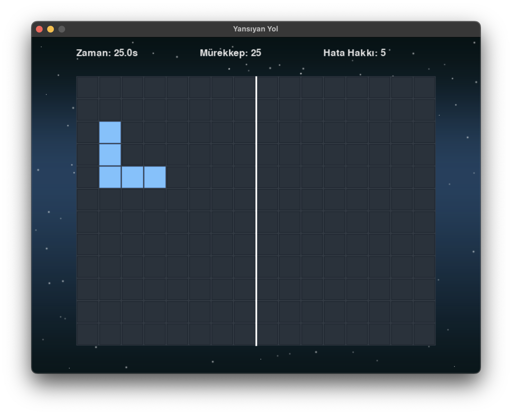
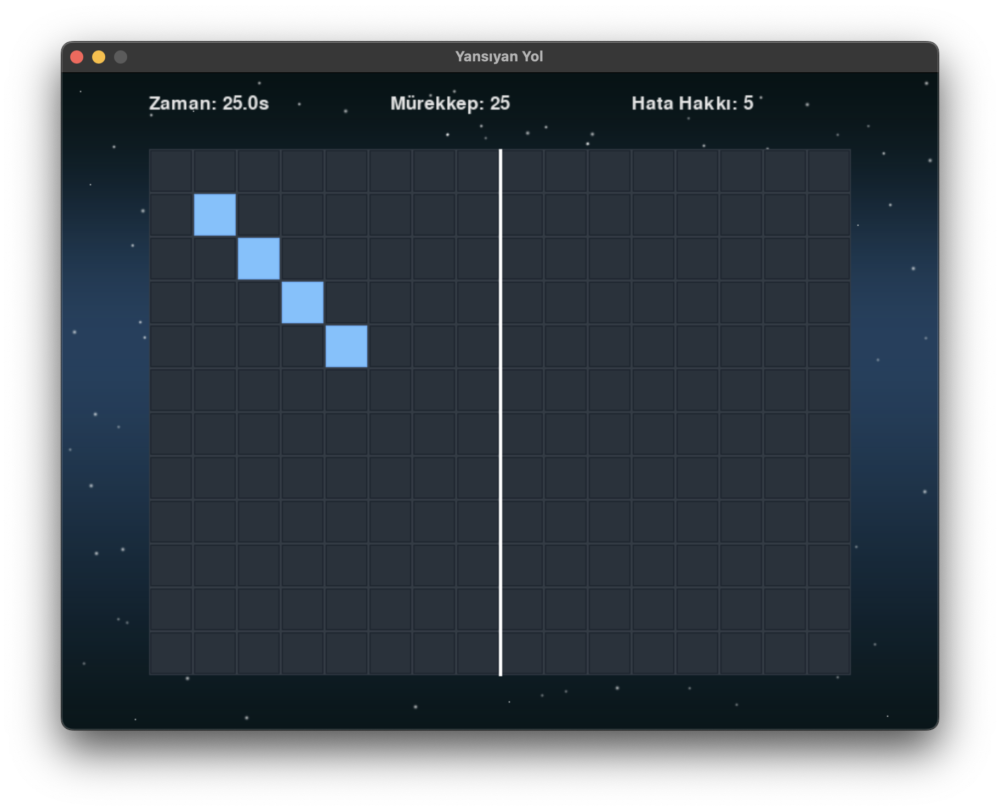

# Reflected Path

 


A logic and memory puzzle game developed using Python and Pygame. The player must memorize a path shown on one side of a symmetry line and accurately replicate its reflection on the other side before time runs out, within ink limits, and without making too many mistakes.

## Table of Contents

- [Features](#features)
- [Requirements](#requirements)
- [Installation](#installation)
- [How to Play](#how-to-play)
- [Project Structure](#project-structure)
- [Technologies Used](#technologies-used)
- [Future Improvements (Optional)](#future-improvements-optional)
- [License](#license)

## Features

*   **Core Mechanic:** Memorize and reflect paths across a central symmetry line.
*   **Level Progression:** 25 levels with increasing complexity and path length.
*   **Challenge Elements:**
    *   **Time Limit:** Each level has a time limit to complete the reflection.
    *   **Ink Limit:** Players have a limited number of tiles they can place ("ink").
    *   **Mistake Limit:** Placing a tile in an incorrect location counts as a mistake, with a limit per level.
*   **Level-Specific Settings:** Time, ink, and mistake limits can vary per level for tailored difficulty.
*   **Visual Feedback:** Tiles change color instantly or with animation to indicate correct/incorrect placement.
*   **Audio Feedback:** Sound effects for key actions like clicking, correct/incorrect placement, level completion, game over, and low time warnings.
*   **Simple UI:** Displays remaining time, ink, and mistake allowance.
*   **Basic Animations:** Tile color transitions and sequential path reveal.
*   **Modular Code Structure:** Organized code using classes and separate modules for configuration, levels, tiles, and game logic.

## Requirements

*   **Python:** Version 3.10 or higher recommended.
*   **Pygame:** Version 2.1.0 or higher (check `requirements.txt`).

## Installation

1.  **Clone the repository (or download the source code):**
    ```bash
    git clone <repository_url> # Eğer GitHub'daysa
    cd reflected_path
    ```
2.  **Create and activate a virtual environment (Recommended):**
    ```bash
    python -m venv venv
    # Windows
    .\venv\Scripts\activate
    # macOS / Linux
    source venv/bin/activate
    ```
3.  **Install dependencies:**
    ```bash
    pip install -r requirements.txt
    ```

## How to Play

1.  **Run the game:**
    *   Navigate to the project's root directory (`reflected_path/`) in your terminal (make sure your virtual environment is active).
    *   Execute the main script:
        ```bash
        python src/main.py
        ```
2.  **Gameplay:**
    *   At the start of each level, a path will be briefly revealed sequentially on the **left** side of the white symmetry line. **Memorize this path.**
    *   After the path disappears, a timer will start, and your ink/mistake counters will be active.
    *   Using the **left mouse button**, click on the tiles on the **right** side of the symmetry line to draw the **exact reflection** of the path you memorized.
    *   **Green tiles** indicate a correct placement.
    *   **Red tiles** indicate an incorrect placement and count towards your mistake limit.
    *   You must complete the reflection before the **time runs out**, before you run out of **ink**, and without exceeding the **mistake limit**.
    *   Complete all 25 levels to win the game!
    *   If you fail a level (time, ink, or mistakes), you can click or press any key to restart from Level 1.

## Project Structure

```plaintext
reflected_path/
├── .git/
├── venv/
├── .gitignore
├── assets/
│ ├── images/ (e.g., background.png, screenshot.png)
│ └── sounds/ (e.g., click.wav, correct.wav, etc.)
├── src/
│ ├── init.py
│ ├── config.py # Constants and settings
│ ├── tile.py # Tile class definition
│ ├── level_data.py # Level path data and settings
│ ├── game.py # Main Game class (logic, loop)
│ └── main.py # Entry point script
├── README.md # This file
└── requirements.txt # Python dependencies
```

## Technologies Used
*   **Python:** Programming language used for development.
*   **Pygame:** Library for game development, providing graphics, sound, and input handling.
*   **Git:** Version control system for tracking changes in the codebase.
*   **GitHub:** Platform for hosting the code repository.
*   **Visual Studio Code:** IDE used for development.


## Future Improvements

*   Enhanced graphics (tile sprites, particle effects).
*   Background music and improved sound design.
*   More sophisticated animations (UI elements, level transitions).
*   Additional game modes or mechanics (different symmetry types, special tiles).
*   Main menu and options screen (volume control, difficulty).
*   Undo functionality.
*   High score tracking.

## License
This project was developed for educational purposes.